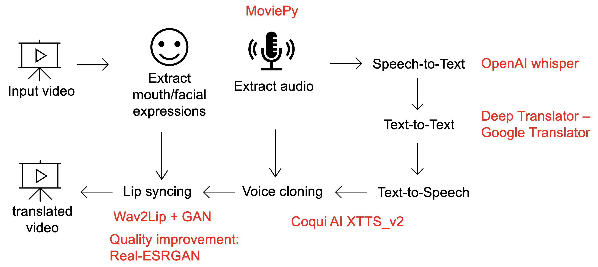

# 🎬 DubMaster – AI-Powered Video Translator

> Automatically translate, dub, and lip-sync short videos using AI – in **German**, **English**, **Hindi**, and **Turkish**.  
> Co-developed by **Merve Altuntaş** and **Andrika Kapoor**

## 🌍 Supported Languages

DubMaster helps you translate videos into:

**Turkish**  

**Hindi**  

**English**  

## 🎯 Project Summary

DubMaster is an AI-powered pipeline for **multilingual video translation**. It:
- Transcribes speech from a video
- Translates the text into the target language
- Synthesizes a **cloned voice**
- Matches the **lip movements** to the dubbed language

This allows you to create natural, multilingual content without losing the personality of the speaker.

## ⚙️ How It Works

1. 🎧 Extract Audio from Video  
2. 🗣️ Transcribe Speech using Whisper  
3. 🌐 Translate Text using Google Translate API  
4. 🧠 Synthesize Voice with XTTS  
5. 👄 Match Lip Movements via Wav2Lip & Real-ESRGAN  
6. 📽️ Combine Audio + Video into a final dubbed output

## 📘 User Manual

To get started, open the file:  
📄 `DubMaster_AI_Video_Translator.ipynb` in **Google Colab**

👉 

The notebook contains:
- Step-by-step instructions
- ⚠️ Warnings before each cell to help you avoid errors
- Hints for best output quality

For a complete overview of DubMaster's features, instructions and legal considerations, see the full PDF manual:  
📘 [DubMaster Manual (PDF)](https://github.com/andrika-ka/DubMaster-AI_Powered_Video_Translator/blob/main/Manual_DubMaster.pdf)

## ⚠️ Copyright Notice

When using DubMaster, you must respect copyright laws:

- Do not use videos or audio files unless you have permission
- Use only public domain / Creative Commons content when uncertain
- We are **not liable** for any misuse of this tool

## 👥 Authors

**Merve Altuntaş**  
🎓 Master Student – Heilbronn University of Applied Sciences / Heidelberg University  
📧 merve00altuntas@gmail.com  

**Andrika Deeka Kapoor**  
🎓 Master Student – Heilbronn University of Applied Sciences / Heidelberg University  
📧 andrika@hotmail.de

## 🧑‍💻 Contributions

- **Andrika Kapoor**  
  → Whisper integration (STT), translation logic, pipeline testing  
- **Merve Altuntaş**  
  → TTS synthesis, lip-sync integration, final system architecture

## ❤️ Our Vision

DubMaster was developed to simplify **multilingual video creation** and promote **inclusive content** across borders.  
Whether you're an educator, a creator, or a global brand – DubMaster makes your voice speak every language.

